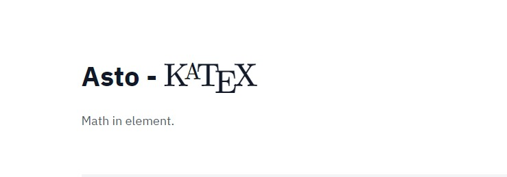

# astro-katex [![NPM version][npm-image]][npm-url]



> Astro component to auto-render math in element, based on [Katex](https://github.com/KaTeX/KaTeX)

## Install or <a href="https://victor0x16.github.io/demo-astro-katex/" style="color: #ff7f33;">Try it now</a>

```sh
$ npm install --save astro-katex
```

## Usage

### Before using astro-katex

#### Include in your html Katex CSS

```html
<head>
   <link rel="stylesheet" href="https://cdn.jsdelivr.net/npm/katex@0.15.3/dist/katex.min.css" integrity="sha384-KiWOvVjnN8qwAZbuQyWDIbfCLFhLXNETzBQjA/92pIowpC0d2O3nppDGQVgwd2nB" crossorigin="anonymous">
</head>
```

#### Add a new integration
```js
import katex from 'astro-katex';

export default defineConfig({
  integrations: [ katex() ],
});
```
## Math in element

```js
---
import AstroKatex from 'astro-katex/AstroKatex'
---
<AstroKatex is:raw>
  Look again at \(\textbf{Figure A} \) and \(\textbf{Figure B}\). Notice that in both graphs, as  \(x\)  approaches \(7\), the output values approach \(8\). This means
  \[
    \lim_{x \to 7} f(x) = \lim_{x \to 7} g(x)
  \]
</AstroKatex>
```
### Output:
 Look again at $\textbf{Figure A}$ and $\textbf{Figure B}$. Notice that in both graphs, as  $x$  approaches $7$, the output values approach $8$. This means
  $$
    \lim_{x \to 7} f(x) = \lim_{x \to 7} g(x)
  $$

## Using just an Expression

```js
---
import Expression from 'astro-katex/OnlyExpression'
---

A simple mathematical expression:
<Expression>
    \sqrt{3x-1}+(1+x)^2
</Expression>
```
### Output
**A simple mathematical expression:**
$\sqrt{3x-1}+(1+x)^2$

### Options for Katex

A number of options are now supported. For a comprehensive list please visit: [here](https://katex.org/docs/supported.html)

## License

MIT

> **Note:** Some $\LaTeX$ syntax may not be supported by $\KaTeX$ itself.

[npm-image]: https://badge.fury.io/js/astro-katex.svg
[npm-url]: https://npmjs.org/package/astro-katex